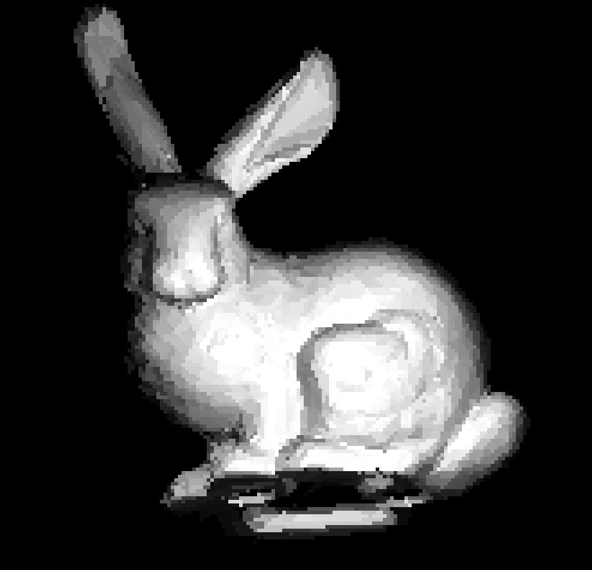

# 3D Software Renderer
A Software Rasterizer/Renderer written in C++ with SDL2.

## To Build (Linux/MacOS)
Make sure you have installed SDL2. Run `make` in the top level folder and run the code with `./3D_renderer` from the terminal. 

## Features
- Uses a software rasterization (No 3D libraries used!) to draw 3D objects on to the screen.
- Displays the object using an SDL2 buffer.
- Uses SDL2 for input.
- Can translate objects with W, A, S, D to move the object up, left, down, and right respectively.
- Can move object forward and back with the Q and E keys respectively.
- Can rotate the object with the T key.
- Provides simple flat shading for objects.
- Clips vertices of the object outside of camera view.
- Uses a Z-Buffer to manage pixel draw priority.

## To Do
- Implement Model Loading
- Implement Texture Mapping
- Implement Texture Loading
- Implement Gourad Shading

## Motivation
I really wanted to develop a deeper understanding of how the real time 3D graphics pipeline works. Thus I went ahead and worked through several resources that taught me how to build a 3D rasterizer and have gone ahead and built my own. I began by implementing the basic linear algebra functionality eventually projecting vertices on to a 2D buffer. Once that was done I implemented line drawing and triangle filling algorithms to actually draw shapes on the screen, finally adding some basic flat shading to add depth to the drawn models.

I also used this as an opportunity to learn some more modern C++ features such as smart pointers and making heavy use of the standard template library when appropriate.

Finally I also learned about the SDL2 library and how it can be used for both input and displaying results as the output.

## References I Used
- [Pikuma: 3D Computer Graphics Programming](https://pikuma.com/courses/learn-3d-computer-graphics-programming) by Gustavo Pezzi - An excellent course that goes through teaching the theory and practice of building a software rasterizer
- [Scratchapixel](https://www.scratchapixel.com/index.html) - Several articles about the math and implementations of various Computer Graphics algorithms