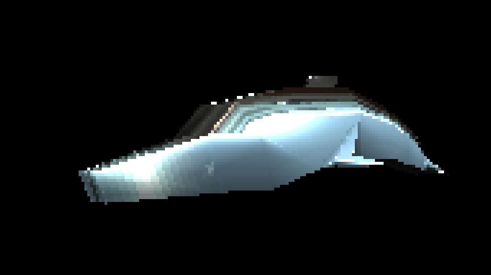

# 3D Software Renderer
A Software Rasterizer/Renderer written in C++ with SDL2.

*Low poly dolphin I modelled. It is rendered with a metal texture using Phong shading and Phong lighting*

## Features
- Uses a software rasterization (No 3D libraries used!) to render 3D objects on to the screen.
- Implements the phong shading and lighting model to light up objects.
- Performs UV mapping to texture objects
- Reads OBJ and TGA files for models and textures respectively.
- Also supports flat shading and full bright objects.
- Uses SDL2 for input and opening a window to display the rendered image.
- Implemented a first person like flying camera to move around the scene
- Can move with W, A, S, D to move forward, strafe left, strafe right, and move back respectively
- Can look by moving the mouse around
- Can alternatively look around with keys Q, E, R, F to look left, look right, look up, and look down respectively
- Press Space to cycle through the available demo scenes
- Clips vertices of the object outside of camera view.
- Performs back face culling to avoid drawing triangles not pointed towards the camera (Toggle with C)
- Uses a Z-Buffer to manage pixel draw priority.

## Motivation
I really wanted to develop a deeper understanding of how the real time 3D graphics pipeline works. Thus I went ahead and worked through several resources that taught me how to build a 3D rasterizer and have gone ahead and built my own. I began by implementing the basic linear algebra functionality eventually projecting vertices on to a 2D buffer. Once that was done I implemented line drawing and triangle filling algorithms to actually draw shapes on the screen, i then added some basic flat shading to add depth to the drawn models. To finish it off I implemented the phong shading and lighting model to render smooth objects.

I also used this as an opportunity to learn some more modern C++ features such as smart pointers and making heavy use of the standard template library when appropriate.

Finally I also learned about the SDL2 library and how it can be used for both input and displaying results as the output.

## To Build
### Linux
Make sure you have installed SDL2. Run `make` in the top level folder and run the code with `./3D_renderer` from the terminal. 

## References I Used
- [Pikuma: 3D Computer Graphics Programming](https://pikuma.com/courses/learn-3d-computer-graphics-programming) by Gustavo Pezzi - An excellent course that goes through teaching the theory and practice of building a software rasterizer
- [Scratchapixel](https://www.scratchapixel.com/index.html) - Several articles about the math and implementations of various Computer Graphics algorithms